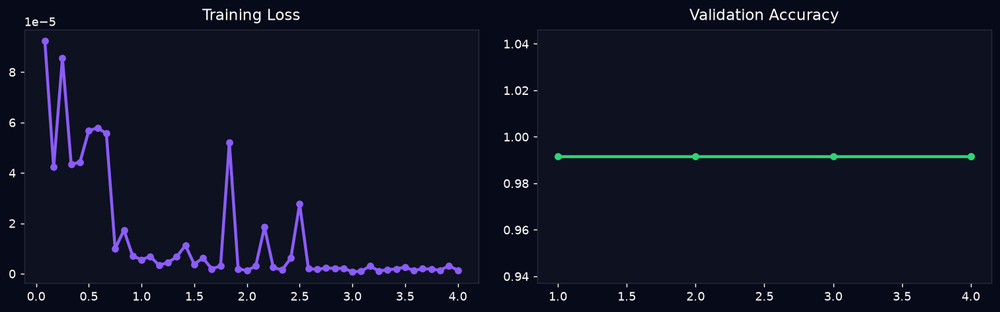

# NEXUS+ — AI Image & Profile Forensics

> A Streamlit-based investigation workspace that combines visual forensics, zero-shot AI detection, and a locally fine-tuned vision model to estimate whether a portrait image is AI-generated.

[](https://www.python.org/)
[](https://streamlit.io/)
[](https://pytorch.org/)



## What it does

Upload a PNG, JPG, JPEG, or WebP portrait and run a forensic scan. NEXUS+ produces an AI threat score, an **Authentic** or **AI-Generated** verdict, a human-versus-AI breakdown, and an explanation from each analysis engine.

The final score is a weighted consensus. If a local fine-tuned ViT checkpoint is available, it receives additional weight because it can learn from confirmed examples in the local dataset.

## Detection engines

| # | Engine | Signal examined |
| --- | --- | --- |
| 01 | Neural network ensemble | Hugging Face image-classification models |
| 02 | CLIP semantic analysis | Zero-shot alignment with real-photo and synthetic-image prompts |
| 03 | Texture smoothness | Micro- and coarse-scale texture variance |
| 04 | Color forensics | Saturation distribution and near-white backgrounds |
| 05 | Frequency domain | FFT and very-high-frequency energy |
| 06 | Background & edge analysis | Studio uniformity, edge detail, and sharpness |
| 07 | Portrait-style analysis | Composition and framing patterns |
| 08 | Face symmetry & micro-texture | Facial symmetry and smoothing cues |
| 09 | Error-level analysis | JPEG compression residuals |
| 10 | Fine-tuned ViT classifier | Optional local AI-vs-real model |

## Quick start

### 1. Clone and create an environment

```bash
git clone https://github.com/sakshamkatoch545-dev/NEXUS-.git
cd NEXUS-
python -m venv venv
```

**Windows (PowerShell)**

```powershell
.\venv\Scripts\Activate.ps1
```

**macOS / Linux**

```bash
source venv/bin/activate
```

### 2. Install dependencies and launch

```bash
pip install -r requirements.txt
streamlit run app.py
```

Streamlit will print a local URL—normally `http://localhost:8501`—to open in your browser.

## Train the local ViT model

NEXUS+ works without a checkpoint, but the tenth engine becomes active after training a local `google/vit-base-patch16-224` classifier. Training images are expected in these folders:

```text
data/dataset/
├── ai/       # AI-generated images (label 0)
└── real/     # Camera-captured / human images (label 1)
```

Run the training script from the repository root:

```bash
python files/train.py --epochs 5 --batch_size 8
```

The trainer automatically creates a validation split, keeps files prefixed with `feedback_` in the training split, saves the best checkpoint under `fine_tuned_vit/`, and writes `eval_results.json` plus `training_curves.png`.

Large model weights and training checkpoints are intentionally ignored by Git. This keeps the repository lightweight; generate them locally or store them with an appropriate model-artifact service.

## Project layout

```text
NEXUS-/
├── app.py                 # Streamlit interface and forensic report UI
├── src/
│   └── detector.py         # 10-engine analysis and weighted verdict logic
├── files/
│   └── train.py            # ViT fine-tuning pipeline
├── data/dataset/
│   ├── ai/                 # AI training samples
│   └── real/               # Real-image training samples
├── fine_tuned_vit/         # Local model outputs and evaluation artefacts
├── prepare_dataset.py      # Offline sample-dataset generator
└── requirements.txt
```

## Requirements

The project uses Python, Streamlit, PyTorch, Transformers, OpenCLIP, OpenCV, Pillow, NumPy, and Requests. Install the exact project dependencies with `pip install -r requirements.txt`.

The first scan may download supported Hugging Face and OpenCLIP models, so an internet connection is useful initially. The optional fine-tuned model is loaded from `fine_tuned_vit/` when present.

## Important limitations

- NEXUS+ is a screening tool, not proof that an image is authentic or synthetic.
- Compression, editing, filters, crops, low resolution, and new image generators can alter the signals it uses.
- A model’s validation score only measures its local held-out dataset; it is not a guarantee of real-world accuracy.
- Do not use the result as the sole basis for moderation, identity, employment, legal, or safety decisions. Review the image context and all engine findings.

## Contributing

Issues and improvements are welcome. When adding a detector or changing the scoring logic, include representative AI and real-image samples, document the evaluation method, and avoid committing large model binaries.

## Author

Created by [@sakshamkatoch545-dev](https://github.com/sakshamkatoch545-dev).
