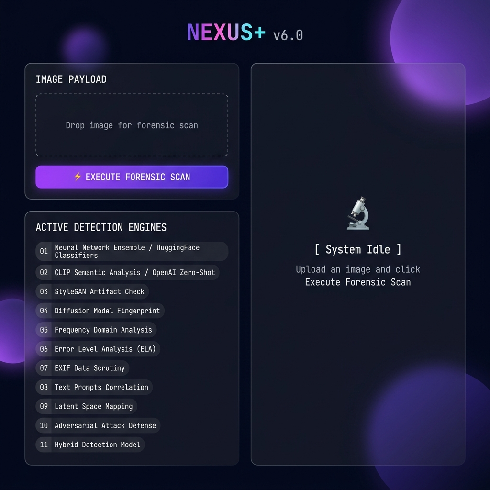
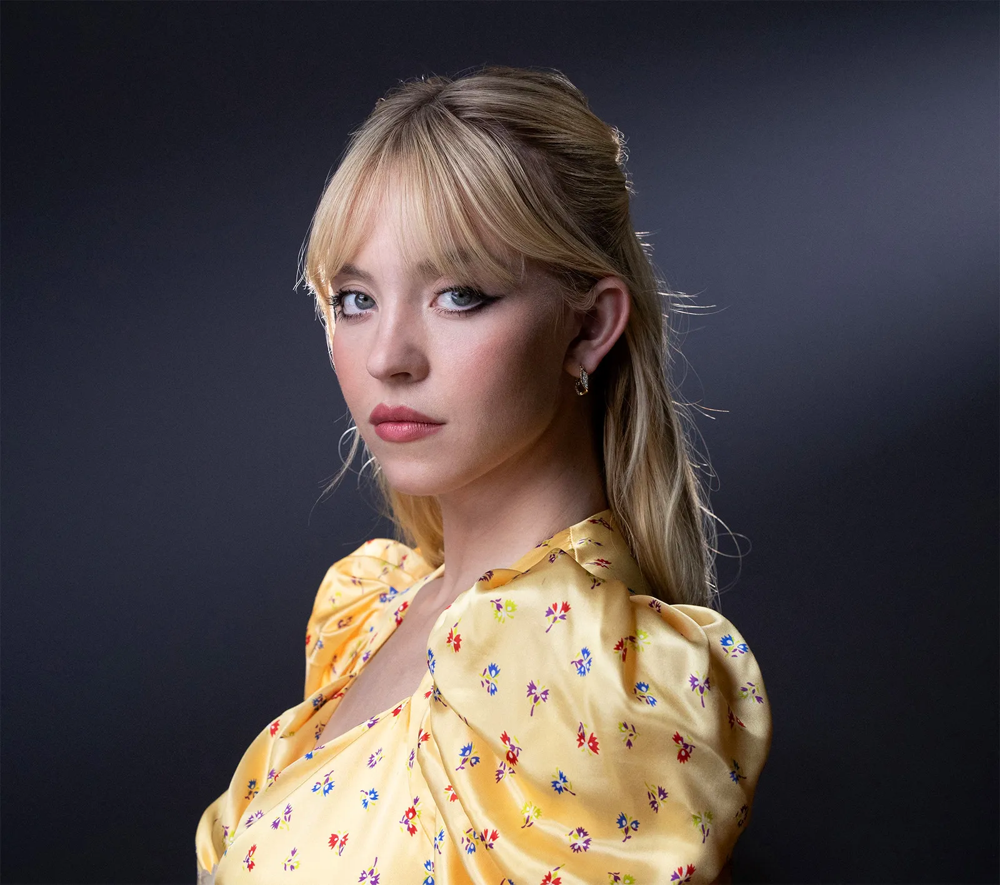
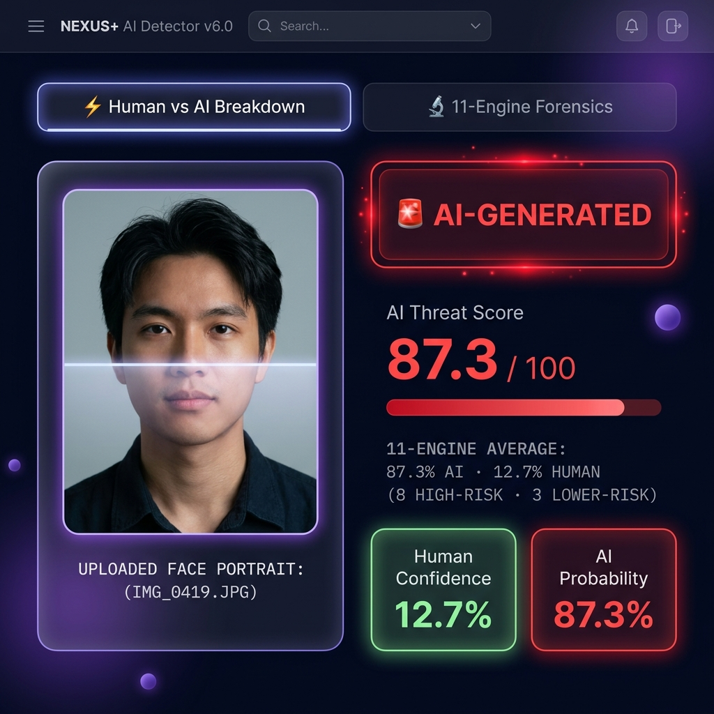
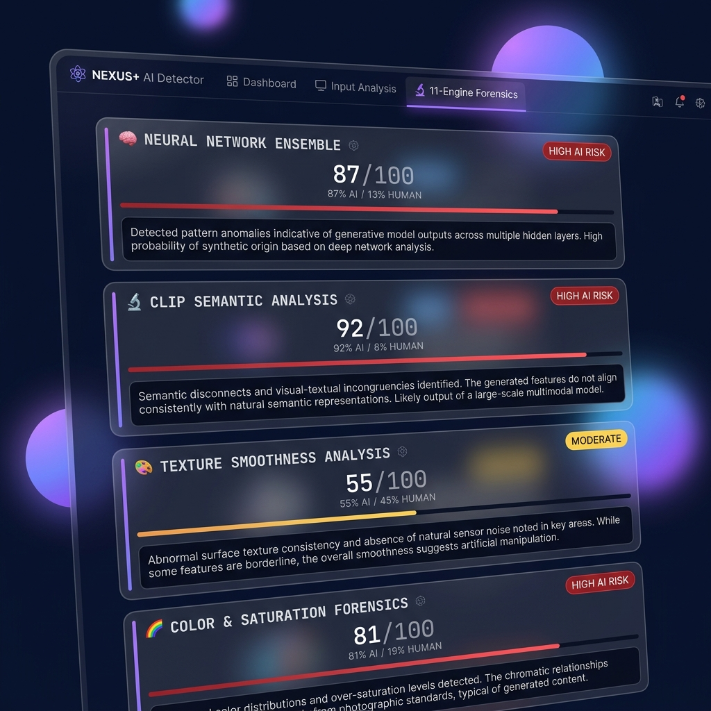

<div align="center">
  
  
  
  
  
  
  <br><br>
  <h1>🔬 NEXUS+ AI Detector v6.0</h1>
  <p><strong>Advanced 12-Engine Forensic Inspection Platform for Synthetic Media Detection</strong></p>
  <br>
  
  <br>
  <em>The NEXUS+ Glassmorphism Dark UI — ready for a forensic scan</em>
</div>

---

## 📖 Overview

**NEXUS+** is a state-of-the-art, multi-modal image forensic platform engineered to detect AI-generated synthetic media with absolute precision. In an era where diffusion models like Midjourney v6, SDXL, and DALL-E 3 create hyper-realistic imagery, traditional single-model detection methods fail catastrophically. 

NEXUS+ solves this by cross-referencing **high-level semantic embeddings** with **microscopic, low-level signal processing** (Fourier transforms, Error Level Analysis, and micro-texture variance) to expose the invisible fingerprints that every AI generator leaves behind.

### ✨ Key Highlights
- 🧠 **12 Specialized Detection Engines** — deep, multi-domain analysis
- ⚡ **Instant Verdicts** — AI-Generated / Uncertain / Authentic  
- 📊 **Per-Engine Breakdown** — see exactly what each engine found
- 🎨 **Premium Glassmorphism UI** — modern, dark, and strikingly beautiful
- 🔄 **Self-Improving** — supports local fine-tuning with your own dataset

---

## 🖥️ How It Works — Step by Step

### Step 1 — Launch the App

Open your terminal, activate your virtual environment, and run:
```bash
streamlit run app.py
```
Your browser will open automatically at `http://localhost:8501`.

---

### Step 2 — Upload an Image

On the **left column**, you will see the **Image Payload** card. Drag & drop any image (JPG, PNG, WEBP) into it, or click **Browse File** to open a file picker.

<p align="center">
  
  &nbsp; &nbsp;
  
</p>
<p align="center">
  <em>Left: An AI-generated image (high saturation, unnaturally smooth textures, studio backdrop) — Right: A real photograph with natural lighting and organic detail</em>
</p>

After uploading, a preview of your image appears inside the card. Below it are the **12 Active Engines** listed — all 12 engines will be engaged once you fire the scan.

---

### Step 3 — Execute Forensic Scan

Click the glowing **⚡ Execute Forensic Scan** button. The system begins running all 12 engines in parallel, performing:
- Neural classification via HuggingFace pipelines
- CLIP zero-shot semantic embedding comparison  
- Computer vision analysis (FFT, ELA, texture, symmetry)
- Local ViT model inference (if trained)
- Watermark margin detection

---

### Step 4 — Review the Verdict

The **right column** transforms to show your full forensic report:

<p align="center">
  
</p>
<p align="center">
  <em>The verdict panel showing a high-confidence AI-Generated result with 87.3% AI probability</em>
</p>

The **verdict box** displays one of four outcomes:
| Verdict | Meaning | Color |
|---|---|---|
| 🚨 **AI-GENERATED** | Strong AI signature detected across multiple engines | 🔴 Red |
| 🪄 **LIKELY REAL BUT EDITED BY AI** | Genuine camera foundation with localized AI inpainting, neural edits, or filters | 🟠 Amber |
| ⚠️ **UNCERTAIN** | Mixed signals — borderline case requiring review | 🟡 Yellow |
| ✅ **AUTHENTIC** | Natural camera characteristics confirmed | 🟢 Green |

The **Human vs AI Breakdown** tab shows:
- **AI Threat Score** out of 100
- **Human Confidence %** vs **AI Probability %** metric cards
- A **Forensic Summary** explaining the key findings in plain language

---

### Step 5 — Drill Into Each Engine

Switch to the **🔬 12-Engine Forensics** tab for the full deep-dive:

<p align="center">
  
</p>
<p align="center">
  <em>The 12-Engine Forensics tab — each engine shows its own score, risk badge, progress bar, and detailed explanation</em>
</p>

Each engine card shows:
- **Engine icon and name**
- **Risk badge** — `HIGH AI RISK`, `MODERATE`, or `LOW AI RISK`
- **Score** (e.g. `87 / 100`) with human/AI split percentage
- **Animated progress bar** colored by risk level
- **Detailed explanation** — a paragraph describing what the engine found and why it scored the image the way it did

---

## 🚀 The 11 Detection Engines

### 🧠 Layer 1 — Neural & Semantic Analysis

| # | Engine | Technology | What it Detects |
|---|---|---|---|
| 01 | **Neural Network Ensemble** | HuggingFace Classifiers | High-level AI/real classification |
| 02 | **CLIP Semantic Analysis** | OpenAI ViT-B-32 Zero-Shot | Semantic alignment with AI/real prompts |
| 10 | **Fine-Tuned ViT Classifier** | Custom ViT Checkpoint | Locally trained AI image classification |

### 🔍 Layer 2 — Signal Processing & Artifact Forensics

| # | Engine | Technology | What it Detects |
|---|---|---|---|
| 03 | **Texture Smoothness** | Multi-Scale Micro-Variance | Unnatural pixel-level smoothing |
| 05 | **Frequency Domain (FFT)** | Fourier Energy Spectrum | High-frequency sensor noise deficit |
| 09 | **Error Level Analysis (ELA)** | JPEG Compression Residual | Uniform compression artifacts |
| 11 | **Watermark Detection** | Contour Margin Analysis | Generator watermarks & logos |

### 🎨 Layer 3 — Composition & Color Forensics

| # | Engine | Technology | What it Detects |
|---|---|---|---|
| 04 | **Color & Saturation** | HSV Saturation Distribution | Hyper-stylized vivid palettes |
| 06 | **Background & Edge** | Studio Uniformity Check | Flat gradient backdrops |
| 07 | **Portrait Style** | Composition & Framing | AI diffusion framing patterns |
| 08 | **Face Symmetry & Smoothness** | Facial Landmark & Blur | Unnatural bilateral symmetry |

---

## 📁 Project Structure

```text
NEXUS+/
├── app.py                  # Main Streamlit UI application (glassmorphism theme)
├── src/
│   └── detector.py         # Core forensic logic — all 11 detection engines + scoring
├── screenshots/            # App UI screenshots (auto-generated)
├── sample_images/          # Real and AI-generated test images
├── scripts/                # Auxiliary debugging and model training scripts
│   ├── debug_gemini.py
│   ├── diag.py
│   ├── prepare_dataset.py
│   ├── test_detector.py
│   └── test_scoring.py
├── logs/                   # System and training execution logs
├── requirements.txt        # Python dependencies
└── README.md               # This documentation
```

---

## ⚙️ Installation & Setup

### Prerequisites
- Python 3.10 or higher
- CUDA-capable GPU (recommended for ViT models; CPU fallback available)

### Quick Start

```bash
# 1. Clone the repository
git clone https://github.com/sakshamkatoch545-dev/NEXUS-.git
cd NEXUS-

# 2. Create and activate a virtual environment
python -m venv venv
venv\Scripts\activate       # Windows
# source venv/bin/activate  # macOS/Linux

# 3. Install all dependencies
pip install -r requirements.txt

# 4. Run the application
streamlit run app.py
```

---

## 🛡️ License & Disclaimer

<div align="center">
  <p><i>Developed for advanced forensic research, academic study, and synthetic media detection.<br>
  NEXUS+ is an analytical aid tool — no automated detection system is infallible.<br>
  Always apply human expert discretion for critical decisions.</i></p>
  <br>
  <strong>NEXUS+ AI Detector v6.0 &nbsp;·&nbsp; Built with Streamlit, PyTorch, OpenAI CLIP & OpenCV</strong>
</div>
# AI provenance engine (v6)

The detector now includes `ai_provenance`, a dedicated weak-signal engine for
ChatGPT/GPT Image, Gemini/Imagen, and other modern generators. It combines
generator-family semantic compatibility with available EXIF/C2PA hints and
reports `nearest_generator`, `similarity`, `detected_artifacts`, and
`feature_scores` in the main JSON response. It does not claim exact provider
attribution: resizing, screenshots, and social-media recompression can remove
provenance and alter visual evidence.

To enable the multimodal API engine, configure secrets outside source control:

```powershell
$env:GEMINI_API_KEY = "your-gemini-key"
$env:GROQ_API_KEY = "your-groq-key"
streamlit run app.py
```

The code tries Gemini first and Groq vision as a fallback. API keys are never
written to the repository or returned in analysis results.
